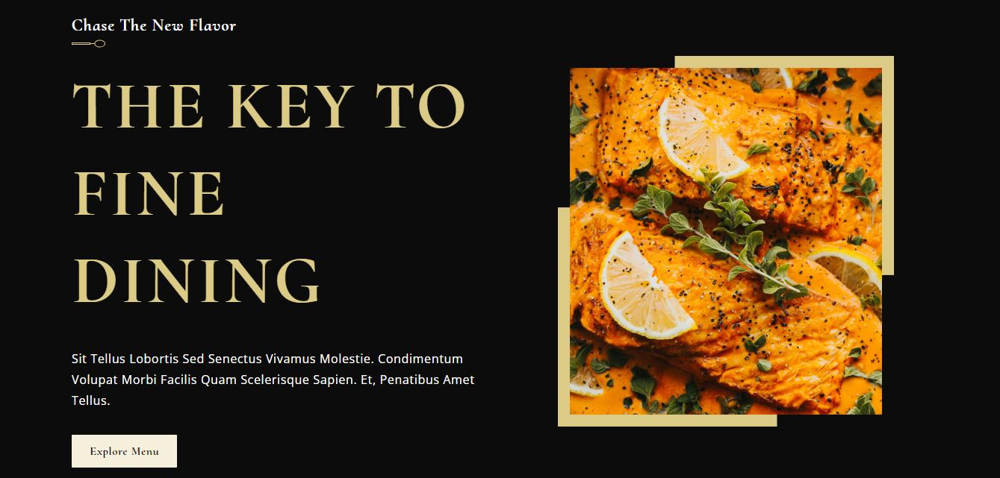

# React Gericht Restaurant

Slicing responsive Gericht Restaurant home page Figma design with `React` and plain `CSS`.

[**Demo**](https://react-gericht-restaurant.web.app) | [**Figma Design**](https://ui8.net/iqonicdesign/products/gericht-restaurant-website-ui-in-figma)



## Quicskart

> **Requirements**:
>
> - Node JS
> - NPM
> - Git

Download or clone repository

```bash
git clone https://github.com/fuadmln/react-gericht-restaurant.git

# install package in project folder (once)
npm install
```

Start development server

```bash
npm run dev
```

Build

```bash
npm run build
```

## Folder Structure

```text
.
├── ...
├── src         
│   ├── assets
│   ├── components
│   │   ├── Component1
│   │   │   ├── component1.jsx
│   │   │   ├── component1.css
│   │   │   ├── component2.jsx
│   │   │   ├── component2.css
│   │   │   ├── ...
│   │   ├── Component2
│   │   ├── ...
│   ├── constants
│   └── container
│   │   ├── Container1
│   │   │   ├── container.jsx
│   │   │   ├── container.css
│   │   ├── Container2
│   │   ├── ...
└── ...
```

### `src/container/` **Folder**

This folder holds ***web section*** component folders (**e.g.** Header, Intro, Menu, Gallery, Footer). Each folder consists of `.jsx` and `.css` file.

### `src/components/` **Folder**

This folder holds ***components that forming web section*** folders. Each folder can has multiple `.jsx` + `.css` files.

### `src/constants/` **Folder**

This folder holds `.js` files that contain exported constants for imported to component (**e.g.** menu data, awards, images).

### `src/assets/` **Folder**

This folder holds static files like images or videos.
